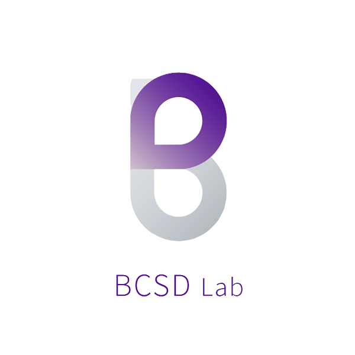

# KAPProejct.github.io

KoreaTech IT특성화동아리 BCSD Lab과 학우들이 만들어가는 KAP 프로젝트를 소개하는 페이지입니다.

## KAP Project

KoreaTech Automation Project의 약자로 KoreaTech에서 느꼈던 불편한 점을 IT기술을 이용해서 자동화하는 것이 목적입니다.

__우리는 교내 생활을 좀 더 빠르고 좀 더 편하게 연결시키는 것을 비전으로 합니다__

## 참여자
### Developers
* **김남훈** 컴퓨터공학부 08학번
* **박혜림** 컴퓨터공학부 13학번
* **손재락** 컴퓨터공학부 13학번
* **정보혁** 컴퓨터공학부 13학번
* **정찬혁** 컴퓨터공학부 12학번
* **박동렬** 전자공학과 15학번

### Directors
* **이보람** 기계공학부 12학번

### Designers
